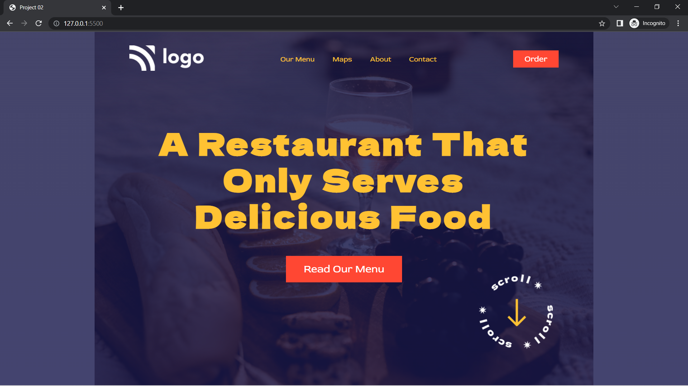

<h1 align="center">Live Class Project 2 - Food Restaurant Home Page</h1>

   Solution for a challenge from Full Stack JavaScript Web Developer Bootcamp  
   <a href="https://ineuron.ai/course/Full-Stack-Javascript-Web-Developer" target="_blank">iNeuron.ai</a>

  <h3>
    <a href="https://vocal-florentine-184d20.netlify.app/" target="_blank">
      Live Demo
    </a>
  </h3>

## Table of Contents

- [Overview](#overview)
  - [Built With](#built-with)
- [Acknowledgements](#acknowledgements)
- [About me](#contact)

## Overview

  <h3> 
    <a href="https://vocal-florentine-184d20.netlify.app/">
      Live Demo
    </a>
  </h3>

### Built With

- [HTML](https://www.w3schools.com/html/)
- [CSS](https://www.w3schools.com/css/)

## Acknowledgements

This application/site/page was created as a submission to a [Full Stack JavaScript Web Developer Bootcamp](https://ineuron.ai/course/Full-Stack-Javascript-Web-Developer) challenge. The challenge was to convert a jpeg/png design to an HTML/CSS webpage.
While working on this **Food Restaurant Home Page** project, it took me almost 1 to 2 hours to complete.

During this project I've learned:

- How to make navigation bar and hero section.
- How layout webpage.
- How to postion element using CSS position properties like `position: relative;` and `posistion: absolute;`.
- How to make button.
- How to center an element.
- How to add transparent overlay.

## About me

Hello, I'm **Ajay Boro**,

I’m a Aspiring Full Stack JavaScript Developer based in India, who solves the problem then writes the code.  
Pursuing Full Stack JavaScript Web Developer Bootcamp at <a href="https://ineuron.ai/course/Full-Stack-Javascript-Web-Developer">iNeuron.io</a>

- GitHub [@ajaybor0](https://github.com/ajaybor0)
- Twitter [@ajaybor0](https://twitter.com/ajaybor0)
- LinkedIn [@ajaybor0](https://www.linkedin.com/in/ajaybor0/)
- Instagram [@ajayborocoding](https://www.instagram.com/ajayborocoding/)
